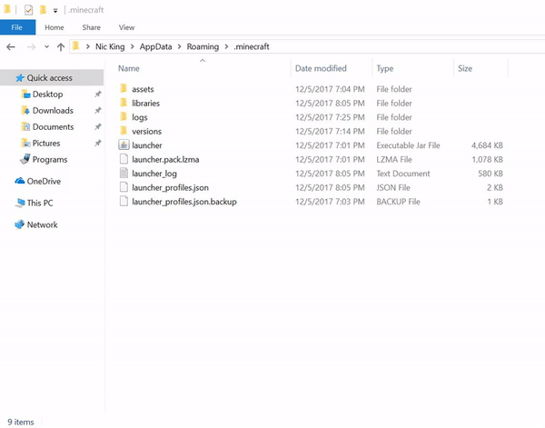

## An Engineer-centric Minecraft Server

_Server Address:_ **minecraft2018.bounceme.net**

**MOD PACK UPDATED (v1.1)**

[DOWNLOAD](https://github.com/macmine13/Smokestacks/releases/download/v1.1/smokestacks-mp1.1.zip)
3/18/18

### Instructions

Smokestacks is a modded server and you need FORGE to use the mods.

1. Download and Install Forge [HERE](http://adfoc.us/serve/sitelinks/?id=271228&url=http://files.minecraftforge.net/maven/net/minecraftforge/forge/1.12.2-14.23.2.2611/forge-1.12.2-14.23.2.2611-installer-win.exe).
2. Download the required mods [HERE](https://github.com/macmine13/Smokestacks/releases/download/v1.1/smokestacks-mp1.1.zip) _(v1.1)_

_Be sure to place the mods inside your "mods" folder inside your ".minecraft" folder like this:_

**Creating a mods folder**

ENJOY!

